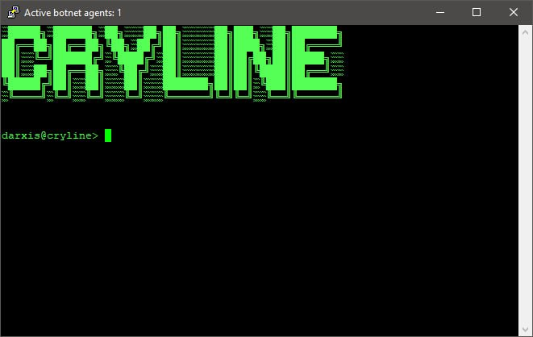
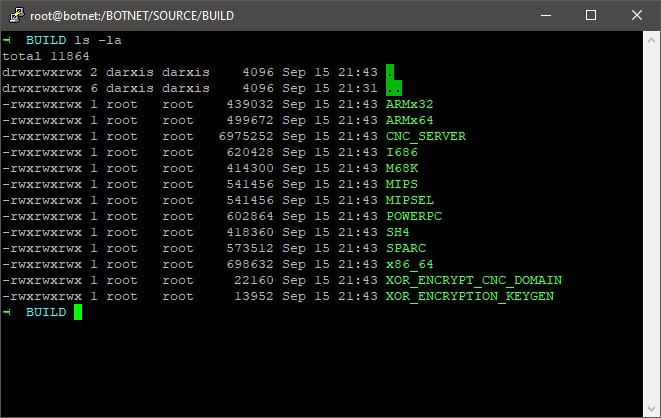
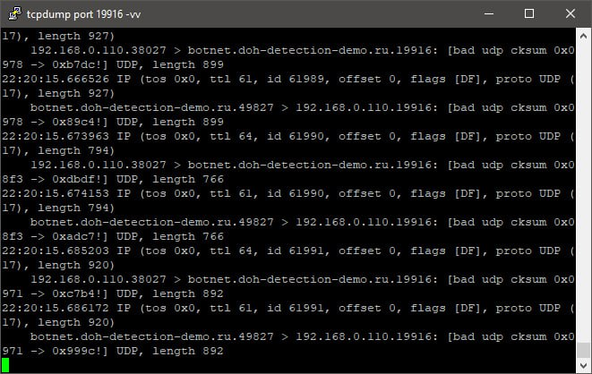

# CRYLINE BOTNET
It's a simple rebuild of MIRAI botnet. I rewrote [MIRAI botnet original source code](https://github.com/jgamblin/Mirai-Source-Code) and delete useless functions (For example: GRE flood). 
Also i fixed any bugs of botnet agent and C&C panel and create new bash scripts to automate the building process.

In C&C source code i use test password to database connection: `g0123011G!`. Please, change this value! This password only for testion and it's rly so weak!

## Supported Architectures

- x86_64
- ARM x32
- ARM x64
- MIPS
- MIPSEL
- I686
- M68K
- POWERPC
- SH4
- SPARC

## Supported attacks

- TCP flood
- UDP flood

Yes, i know that modern botnets use HTTP, WS/WSS, gRPC-web-proto, SOAP etc. ddos different attack techniques but i specifically did not add them for objective reasons. 
